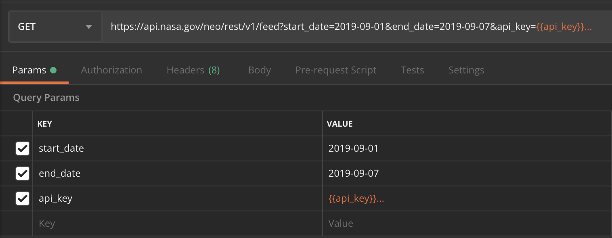

<!--title={Documentation Is not Perfect}-->

<!--badges={}-->

<!--concepts={}-->

Now, just like before, we are going to want to copy and paste the link provided onto Postman. Then, we are going to want to input the missing values in our parameters. 

What we should get is a long JSON object as a response. However, what we are going to do differently from before is that we are going to mess around with the parameters to get a better grasp of what our API can and cannot do. Thus, for our first experiment, we will want to change the end_date to 2019-08-29 to see if an error will occur. 

Surprisingly enough, It still works and provides data! Now, we know that the end date and start date does not matter for this specific API. Now, what if the end_date is moved ahead to 2020? Once the request has been sent, we should get this response: 

Thus, from this little experiment of ours, we know that This API does not care if the end date is before the start date, but it does care about the difference in days between the two.  This little experiment has shown that although documentation is very useful and important, it is not perfect. It will not state Everything about what it is documenting about, and some functions or small intricacies can ***only*** be found through experimenting with the subject in question such as now. 

